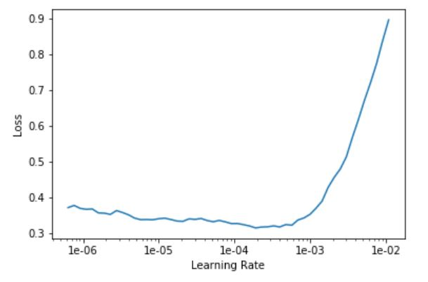

# peruvian-food-identifier

First of all thanks to [Jeremy Howard](https://twitter.com/jeremyphoward) and [Rachel Thomas](https://twitter.com/math_rachel) for such great course as Deep Learning for coders v3!

This small project consists in build a deep learning model to classify 10 types of peruvian food using the fastai library:
* Ceviche
* Ají de gallina
* Lomo saltado
* Causa limeña
* Rocoto relleno
* Tacu tacu
* Anticuchos
* Pan con chicharrón
* Olluquito
* Picante de cuy

# Step 1: Get the dataset

The dataset can be obtained through [Google images](https://images.google.com/), searching for each category and then using a Javascript code in the browser to get a text file which contains all the urls. 

So, first press the <kbd>Ctrl</kbd><kbd>Shift</kbd><kbd>J</kbd> in Windows and then type the following code:
```javascript
urls = Array.from(document.querySelectorAll('.rg_di .rg_meta')).map(el=>JSON.parse(el.textContent).ou);
window.open('data:text/csv;charset=utf-8,' + escape(urls.join('\n')));
```

# Step 2: Download the images

After obtain all the urls files, the next step is download the images. In order to do that, I will use the fastai function `download_images` as follows: 
```python
download_images(path/file, dest, max_pics=400)
```

# Step 3: Train the model

Once the images are stored in the cloud environment (in my case GCP), the next step is create the Data object, the Learner object, and then start the training!:

```python
tfms = get_transforms()
src = (ImageItemList.from_folder(path, train=".")
       .random_split_by_pct(0.2)
       .label_from_folder())
data = (src.transform(tfms, size=128)
        .databunch().normalize(imagenet_stats))
        
learn = create_cnn(data, models.resnet50, metrics=error_rate)
learn.fit_one_cycle(10, max_lr=slice(3e-3))
```

# Step 4: Fine tune the model

After train the last layers of the models, the next step is unfreeze all the layers and continue the training for more epochs. The early layers are trained with a lower learning rate than the last layers, i.e. not all the layer will be optimized with the same learning rate. The reason is because the model used to the training is already pretrained and the first layers already known how to identificate the basic forms of the images.

The best way to identificate the learning rate to train the model is using the learning rate finder already implemented in the fastai library.
```python
learn.unfreeze()
learn.lr_find()
learn.recorder.plot()
```
HERE THE IMAGE


```python
learn.fit_one_cycle(8, max_lr=slice(1e-4))
```

# Step 5: Save the weights of the model

Once the model is already trained, the next step is save the weights of the model in order to be used for predict the class of a new image.

```python
learn.save('stage-2-r50-bs8-rs42-s512-no-opt', with_opt=False)
```
